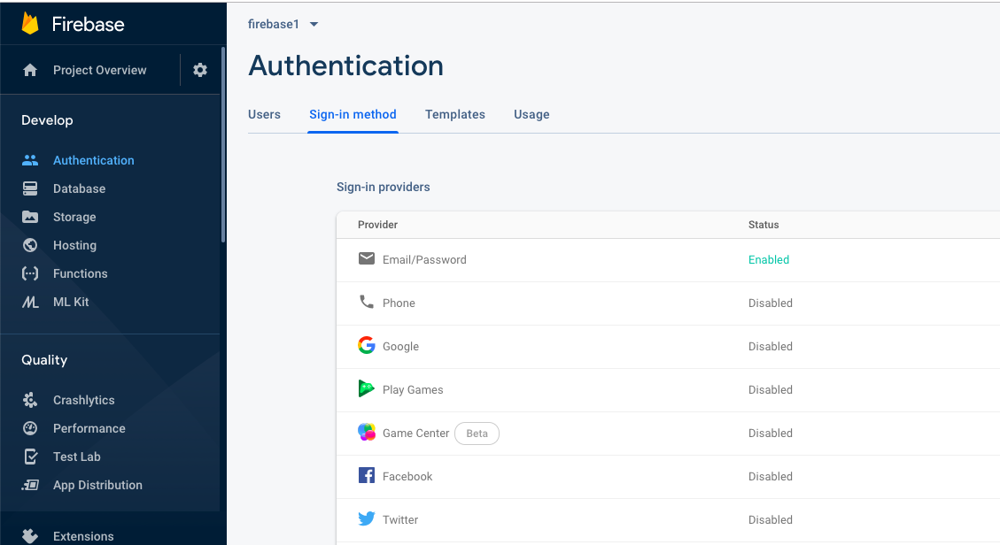
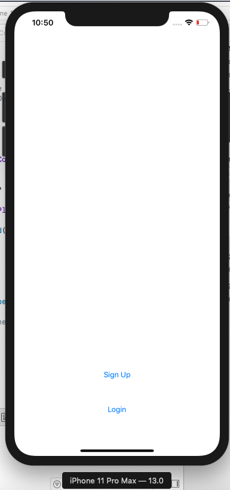
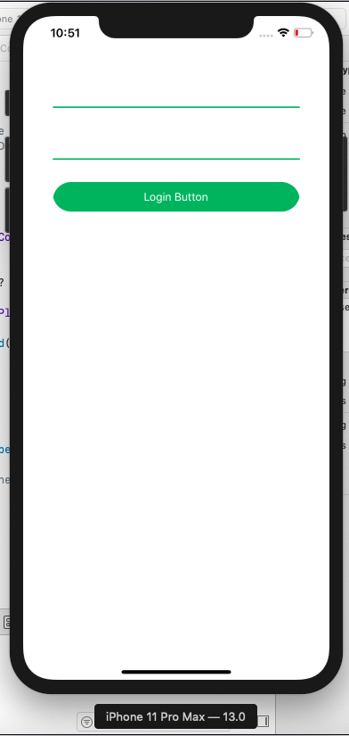
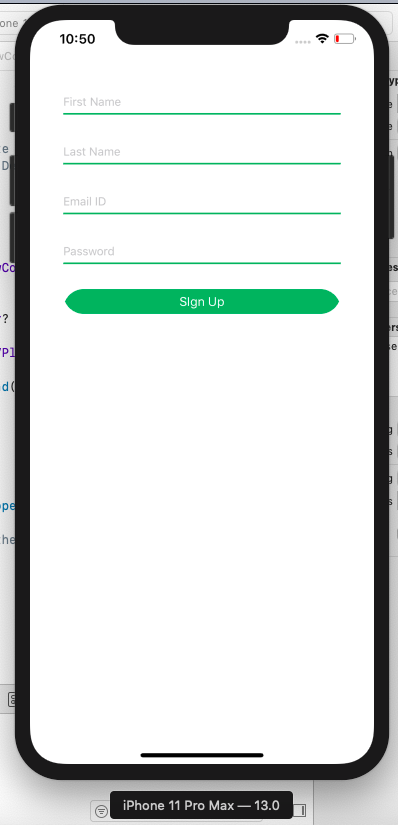
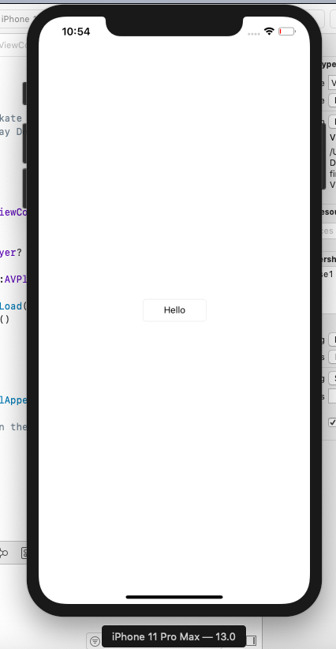

# ios-firebase-signup-login-app
IOS app for login and signup using firebase and cocoapods [learned from https://codewithchris.com/ ]

prerequisite
Xcode
google Firebase account
cocoapod installed on your computer

create new xcode project
(Note-remember the bundle id it should be same that specified in firebase project)
 
create new project in Firebase
opt for ios 
give project name 
and start initalizsing SDK
(Note- Your xcode project bundle id should be same as the bundleID specified in Google Firebase)

download googlefirebase.info.plist file and paste it in the xcode project

run following commands on terminal in project destination folder 
>pod init 

after pod init you will get pod textfile in project folder
edit it and add required pods search for pods in the following link https://firebase.google.com/docs/ios/setup?authuser=1
in our project we required to add following pod files
pod 'Firebase/Analytics'
pod 'Fireabase/core'
pod 'Firebase/Auth'
pod 'Firebase/Firestore'
Install the pods by running the 

>pod install 

on terminal 

close the project and open the .xcworkspace file from the project folder onwords use the same file for development

To connect Firebase when your app starts up, add the initialization code below to your main AppDelegate class.

~~~
import UIKit
import Firebase //add this 

@UIApplicationMain
class AppDelegate: UIResponder, UIApplicationDelegate {

  var window: UIWindow?

  func application(_ application: UIApplication,
    didFinishLaunchingWithOptions launchOptions:
      [UIApplicationLaunchOptionsKey: Any]?) -> Bool {
    FirebaseApp.configure()                    //this is to be added in the above class
    return true
  }
}
~~~

Run the project and check whether it has communicated with the firebase servers or not (on firebase website ios SDK)

In Google Firebase website -> to the project you created -> authentication -> sign in method -> and enable Email/Password

now in xcode create main.storyboard and code for button actions and run the project

IOS App 

when tapped login

when tapped signUp

after successfull SignUp or Login

Follow Video Tutorials:-
https://codewithchris.com/

Please contact:- 
devkatte.akshay98@gmail.com for help if needed

